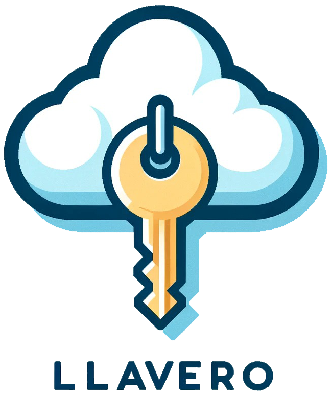

**Llavero: My hardware wallet as MY service.**

Llavero means keyring in spanish. “LLa” is pronounced as “Ya” in Yatch

## Table of Contents

- [Introduction](#introduction)
  - [TL;DR](#tldr)
  - [KMS](#kms)
  - [Software as MY Service (SaMS)](#software-as-my-service-sams)
  - [Llavero's features](#llaveros-features)
    - [Wallet comparisons](#wallet-comparisons)
    - [Status \& contributions](#status--contributions)
  - [Objectives](#objectives)
    - [Why all this?](#why-all-this)
    - [Philosophy](#philosophy)
- [Installation](#installation)
  - [Manual/Dev Installation](#manualdev-installation)
  - [Desktop Installer](#desktop-installer)
- [Develop](#develop)
  - [To Dev:](#to-dev)
    - [To emulate next.js prod on local env](#to-emulate-nextjs-prod-on-local-env)
- [Roadmap and proposals](#roadmap-and-proposals)
- [components and architecture](#components-and-architecture)
  - [Installer](#installer)
  - [Web](#web)

# Introduction

**Llavero: My hardware wallet as MY service. What does this mean?**

### TL;DR

Llavero is a self-service, non-custodial wallet that uses AWS KMS for secure key management, offering a custodial user experience.

### KMS

Major cloud companies like AWS, Azure and Google Cloud offer a service generically referred to as KMS (Key management service).
KMS is a managed service that simplifies the creation and control of cryptographic keys used to protect data. AWS KMS employs Hardware Security Modules (hardware security modules) to safeguard and validate KMS keys under the [FIPS 140-2 Cryptographic Module Validation Program](https://docs.aws.amazon.com/kms/latest/developerguide/overview.html).
HSMs can be thought of as cloud-based hardware wallets, such as Trezor or Ledger, but in the cloud, secured by [AWS’s data centers](https://aws.amazon.com/compliance/data-center/controls/).

AWS KMS is a service where all private keys are securely stored. These keys, generated within the HSM, never leave it. All signing operations are executed within the KMS a concept also known as Cryptography as a Service.

Prominent companies like [OpenZeppelin©](https://www.openzeppelin.com/) leader in the security industry, use AWS KMS to store keys on [Defender](https://docs.openzeppelin.com/defender). [Defender](https://docs.openzeppelin.com/defender/v2/manage/relayers#security-considerations) assists Blockchain companies in signing and securing their crypto assets.

### Software as MY Service (SaMS)

**As MY services** mean that is a self-hosted service. It’s your cloud stack: buckets, DB, CDN, authentication and authorization services, and KMS, without intermediaries. Is a cloud stack design for just one person, as cost-effective as possible, taking advantage of the generous free tier major cloud companies offer.

We are used to the Software as a Service (SaaS) paradigm, where intermediate companies such as OpenZeppelin or DropBox deliver high-quality products to end users, using major cloud companies as vendors. With Software as MY Service (SaMS), the end user can host their services, maintaining absolute control, autonomy and privacy over their digital assets.

## Llavero's features

- Always Recover: User-friendly setup and recovery.
- Enterprise Security: [AWS’s data centers](https://aws.amazon.com/compliance/data-center/controls/). Multiple security layers. MFA (SMS, EMAIL, TOTP, Biometrics (Passkeys))
- Full Privacy: Your infrastructure. Encryption at rest
- Protect Transactions: Whitelist address, MFA, multi-signature approval.

### Wallet comparisons

|                               | Custodial  | Software | Hardware | Llavero           |
| ----------------------------- | ---------- | -------- | -------- | ----------------- |
| **Setup time**                | 1min + KYC | 5 min    | 5 min    | 5 min             |
| **Phrase vulnerabilities**    | NO         | YES      | YES      | NO                |
| **MFA (EMAIL, Biometrics)**   | YES        | FEW      | NO       | YES               |
| **Censorship Resistant**      | NO         | YES      | YES      | NO, but difficult |
| **Protect any digital asset** | NO         | NO       | NO       | Yes               |

### Status & contributions

## Objectives

Can open source create an IaC solution for personal use – easy, secure, 100% private, cheap, and censorship-resistant?

Why? For absolute privacy, security, ease of use, and resilience to secure my assets and personal verifiable credentials.

A self-service should be designed to be for a single user. The user should have hardware isolation to maintain his full privacy. It should not be designed to scale, since is just for one user.

It should be resilient; the end user should not have to spend time maintaining their services.

It should be hardware-agnostic or cloud-agnostic. The user should be able to migrate from one cloud to another.

Ideally, it should be resistant to censorship. If the solution is multi-infrastructure, even if AWS closes your account, you should be able to continue working and not lose anything on another cloud or personal hardware.

### Why all this?

First, because we can :) It should be easy, affordable, and fully private.

Second, in the coming years, our digital identity will be compromised by AI. We need to think of new ways to deliver a technology solution for end users that is easy, secure, private, and fully autonomous.

### Philosophy

    Technology to the people. Provide the best technology as possible to end-users at an affordable cost.

# Installation

## Manual/Dev Installation

GA installation

## Desktop Installer

download

# Develop

## To Dev:

```
Terminal 1

EMAIL="your@email.com" REGION="us-east-1" AWS_ACCESS_KEY_ID="id" AWS_SECRET_ACCESS_KEY="secret" yarn start-sst

Terminal 2

EMAIL="your@email.com" REGION="us-east-1" AWS_ACCESS_KEY_ID="id" AWS_SECRET_ACCESS_KEY="secret" yarn dev
```

### To emulate next.js prod on local env

```
Terminal 1

EMAIL="your@email.com" REGION="us-east-1" AWS_ACCESS_KEY_ID="id" AWS_SECRET_ACCESS_KEY="secret" yarn start-sst

Terminal 2

EMAIL="your@email.com" REGION="us-east-1" AWS_ACCESS_KEY_ID="id" AWS_SECRET_ACCESS_KEY="secret" yarn workspace web sst bind next build
EMAIL="your@email.com" REGION="us-east-1" AWS_ACCESS_KEY_ID="id" AWS_SECRET_ACCESS_KEY="secret" yarn workspace web sst bind next start
```

# Roadmap and proposals

# components and architecture

## Installer

## Web
