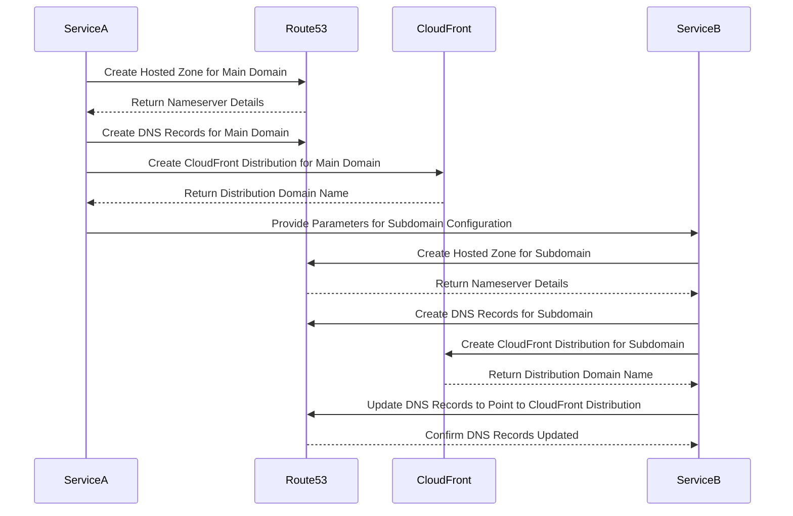

```mermaid
sequenceDiagram
    participant ServiceA
    participant Route53
    participant CloudFront
    participant ServiceB

    ServiceA->>Route53: Create Hosted Zone for Main Domain
    Route53-->>ServiceA: Return Nameserver Details

    ServiceA->>Route53: Create DNS Records for Main Domain
    ServiceA->>CloudFront: Create CloudFront Distribution for Main Domain
    CloudFront-->>ServiceA: Return Distribution Domain Name

    ServiceA->>ServiceB: Provide Parameters for Subdomain Configuration
    ServiceB->>Route53: Create Hosted Zone for Subdomain
    Route53-->>ServiceB: Return Nameserver Details

    ServiceB->>Route53: Create DNS Records for Subdomain
    ServiceB->>CloudFront: Create CloudFront Distribution for Subdomain
    CloudFront-->>ServiceB: Return Distribution Domain Name

    ServiceB->>Route53: Update DNS Records to Point to CloudFront Distribution
    Route53-->>ServiceB: Confirm DNS Records Updated
```
