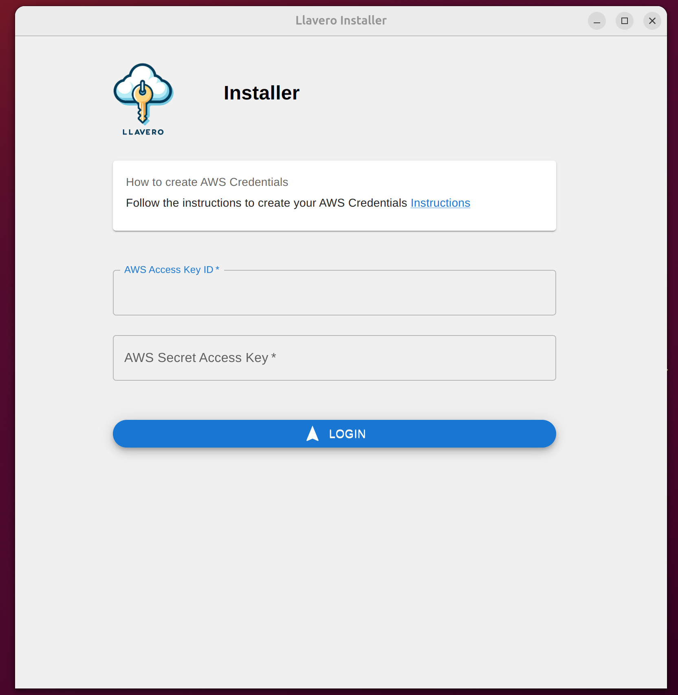
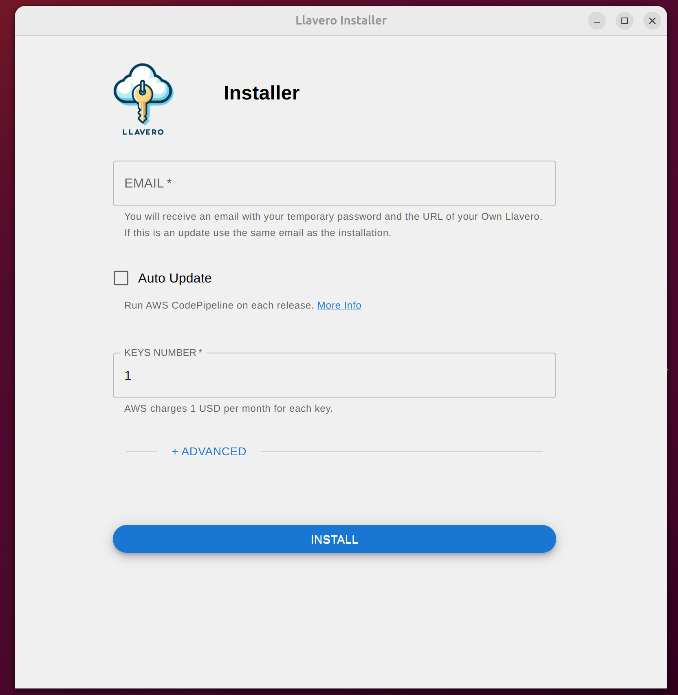
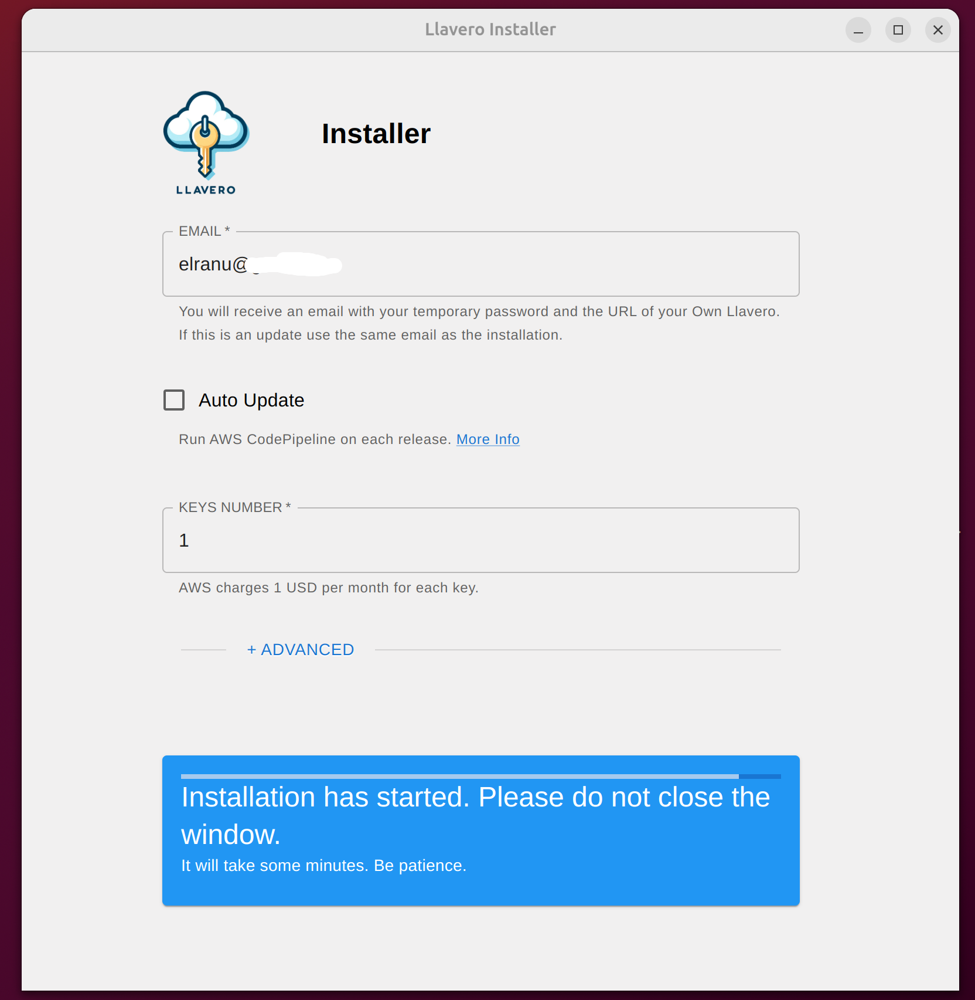
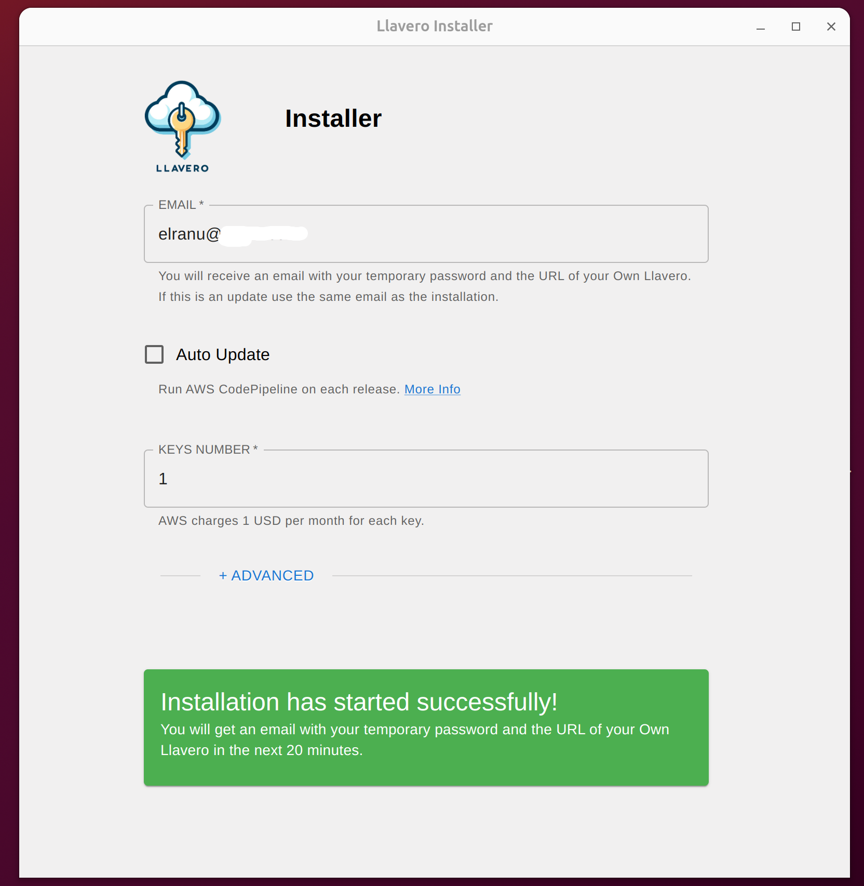

# Desktop installation

### 1. Create your AWS Credentials -> [Guide](./create-credentials.md)

### 2. Download -> [Github Release](https://github.com/llaverowallet/llavero/releases/)

### 3. Run and Login with the credentials on the desktop installer

### 4. Complete your email and select how many keys you wanna create

### 5. Click install and wait

### 6. Check your email in the next 20 min to get your URL and your temporary password

