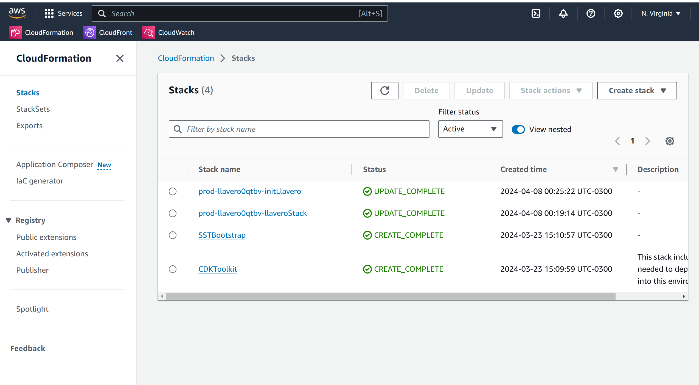
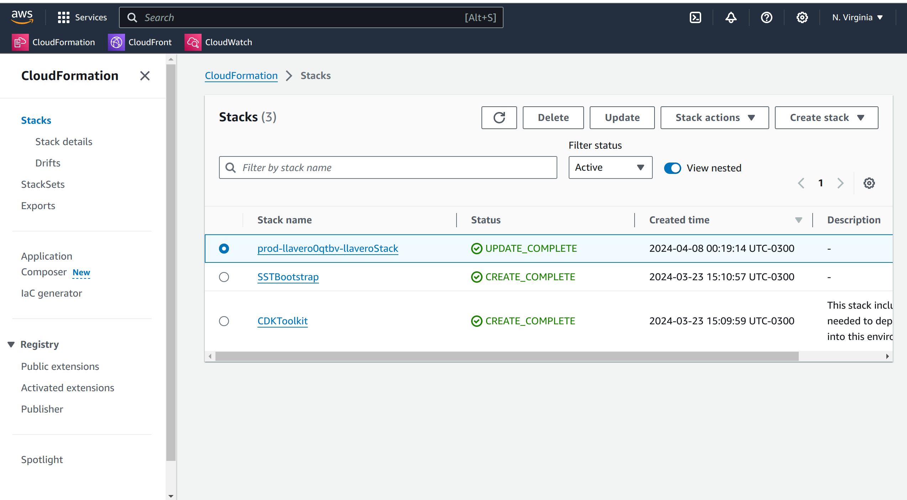
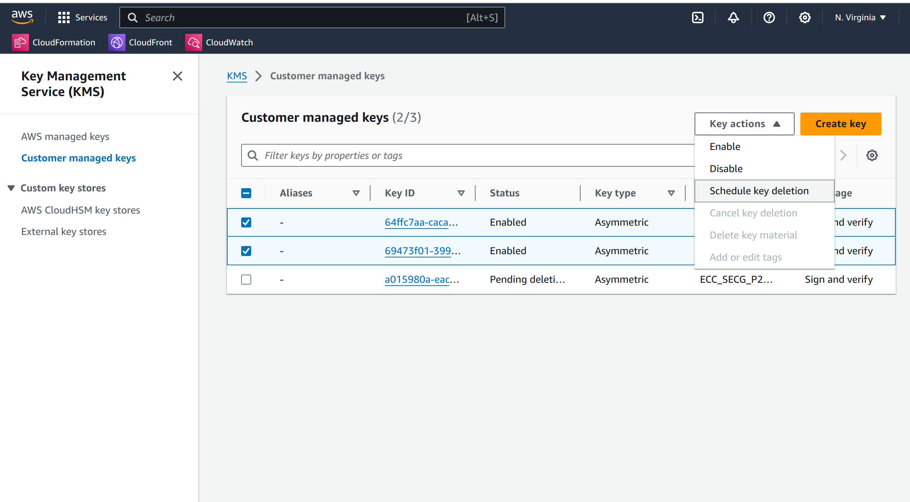
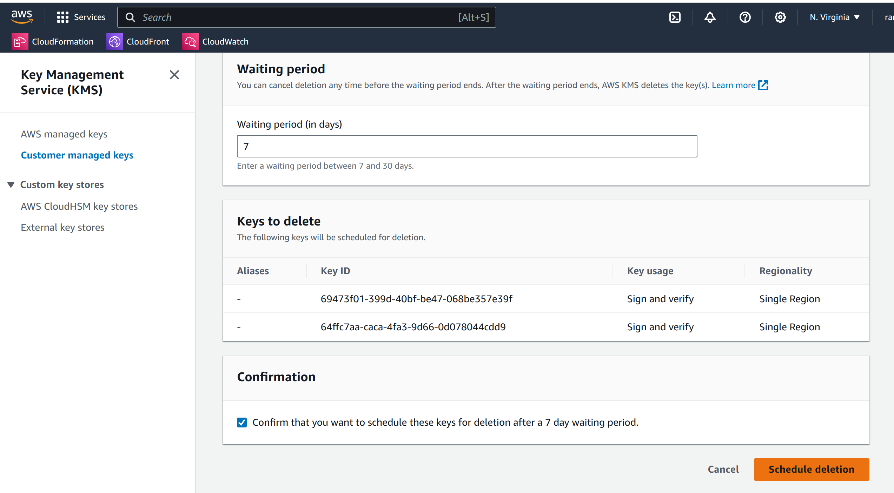

# Uninstall Llavero

### Before you start please move your crypto. Onces deleted is not recoverable

### 1. Enter as root to your AWS Account

### 2. Go to CloudFormation

### 3. Delete the stacks

- #### Delete first the one that ends with "initLlavero"

### 4. Delete "llaveroStack"

- #### Delete second the one that ends with "llaveroStack"

### 5. Delete your keys

- #### Select the keys and press "Schedule key deletion"

### 6. Downgrade your Waiting period

- #### Downgrade the period to 7, check the confirmation check box and press "Schedule deletion"

