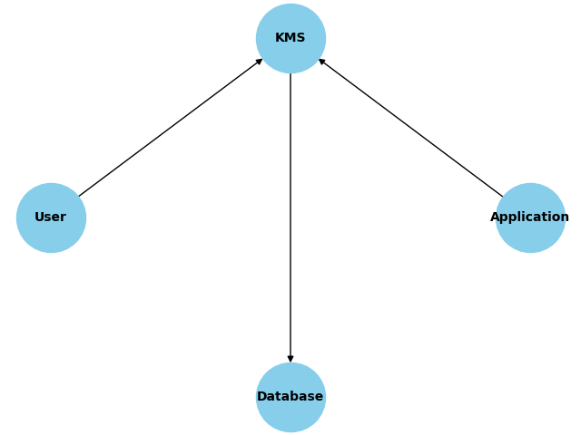
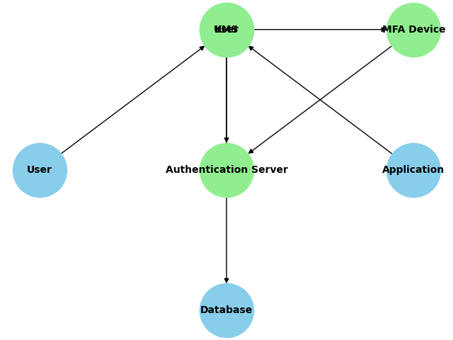
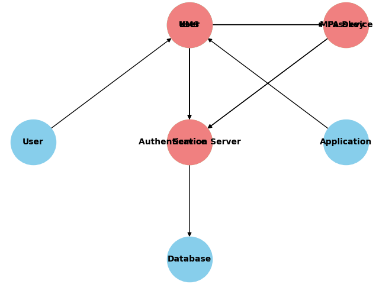
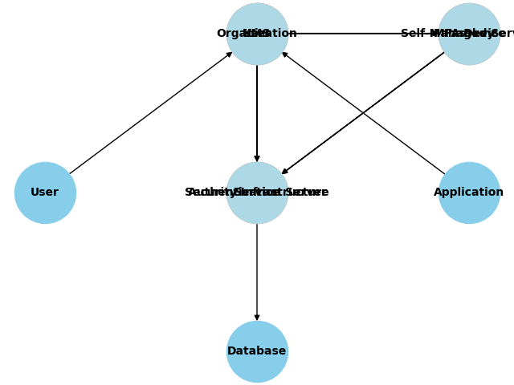

# Whitepaper on the Security of KMS, MFA, Passkeys, and Self-Managed Services

## Introduction
In today's digital age, securing sensitive information is paramount. This whitepaper aims to demonstrate the security of Key Management Service (KMS), Multi-Factor Authentication (MFA), Passkeys, and self-managed services for ordinary users. We will explore the benefits and challenges of each technology and provide recommendations for enhancing security.

## Key Management Service (KMS)
### Benefits
- **Centralized Management**: KMS provides a centralized approach to managing cryptographic keys, making it easier to enforce security policies and practices.
- **Scalability**: KMS can scale to handle large volumes of keys, making it suitable for organizations of all sizes.
- **Compliance**: Many KMS solutions are compliant with industry standards and regulations, ensuring that organizations meet their security and compliance requirements.

*Figure 1: Key Management Service (KMS) Diagram*

### Challenges
- **Complexity**: Implementing and managing a KMS can be complex, requiring specialized knowledge and expertise.
- **Cost**: KMS solutions can be expensive, particularly for small organizations with limited budgets.
- **Reliance on Third Parties**: Using a third-party KMS provider can introduce additional risks, such as vendor lock-in and potential security vulnerabilities.

## Multi-Factor Authentication (MFA)
### Benefits
- **Enhanced Security**: MFA adds an extra layer of security by requiring users to provide multiple forms of authentication, reducing the risk of unauthorized access.
- **User Accessibility**: MFA solutions are widely available and can be easily integrated into existing systems, making them accessible to common users.
- **Flexibility**: MFA can be implemented using various methods, such as SMS, email, biometrics, and hardware tokens, providing flexibility in choosing the most suitable option.

*Figure 2: Multi-Factor Authentication (MFA) Diagram*

### Challenges
- **User Experience**: MFA can sometimes be seen as inconvenient by users, leading to resistance in adoption.
- **Implementation Complexity**: Integrating MFA into existing systems can be complex and may require significant changes to the infrastructure.
- **Cost**: Implementing and maintaining MFA solutions can incur additional costs, particularly for small organizations.

## Passkeys
### Benefits
- **Security**: Passkeys provide a secure and user-friendly alternative to traditional passwords, reducing the risk of password-related attacks.
- **Ease of Use**: Passkeys are easy to use and eliminate the need for users to remember complex passwords.
- **Compatibility**: Passkeys can be used across various platforms and devices, providing a seamless user experience.

*Figure 3: Passkeys Diagram*

### Challenges
- **Adoption**: Widespread adoption of passkeys may take time, as users and organizations need to transition from traditional password-based systems.
- **Compatibility**: Ensuring compatibility with existing systems and applications can be challenging.
- **Cost**: Implementing passkey solutions may require additional investment in infrastructure and training.

## Self-Managed Services
### Benefits
- **Control**: Self-managed services provide organizations with full control over their security infrastructure, allowing them to implement customized security measures.
- **Privacy**: By managing their own services, organizations can ensure that sensitive data is kept private and secure.
- **Continuous Improvement**: Self-managed services allow organizations to continuously improve their security posture by implementing the latest security practices and technologies.

*Figure 4: Self-Managed Services Diagram*

### Challenges
- **Complexity**: Managing security infrastructure in-house can be complex and resource-intensive, requiring specialized knowledge and expertise.
- **Cost**: Implementing and maintaining self-managed services can be expensive, particularly for small organizations with limited budgets.
- **Responsibility**: Organizations are fully responsible for the security of their self-managed services, which can be a significant burden.

## Conclusion and Recommendations
In conclusion, KMS, MFA, Passkeys, and self-managed services each offer unique benefits and challenges in enhancing security for ordinary users. Organizations should carefully consider their specific needs and resources when choosing the most suitable security solutions. By implementing best practices and continuously improving their security posture, organizations can effectively protect their sensitive information and reduce the risk of security breaches.

## Bibliography
- [Llavero.app website](https://llavero.app)
- [Llavero's GitHub repository](https://github.com/llaverowallet/llavero)
- [HackerNoon article about Llavero](https://hackernoon.com/introducing-llavero-the-$1-hardware-wallet)
- NIST SP 800-152: A Comprehensive Guide to Key Management
- AWS KMS FAQs
- Cryptomathic Blog on Centralized Key Management Systems
- FutureCIO on Securing Data with Key Management Systems
- UpGuard Blog on Cybersecurity Metrics
- Gartner on Key Management and Security Trends
- IBM's Unified Key Orchestrator Blog
- NIST SP 800-57 Part 1: General Guidance on Key Management
- Springer chapter on Key Management
- "Mission Impossible: Securing Master Keys" by Hannes Salin and Dennis Fokin
- "Shhh!: 12 Practices for Secret Management in Infrastructure as Code" by Akond Rahman, Farhat Lamia Barsha, and Patrick Morrison
